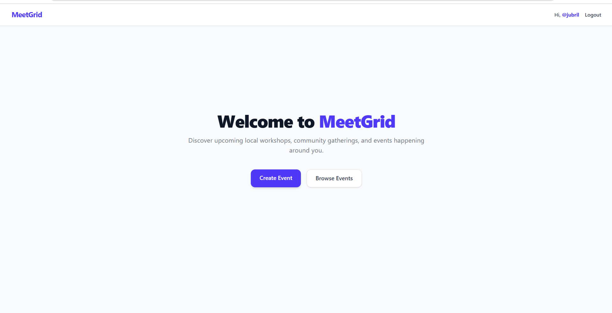
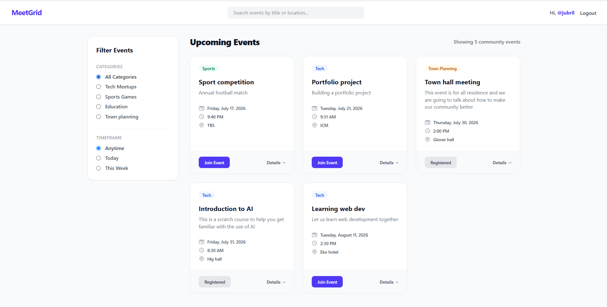
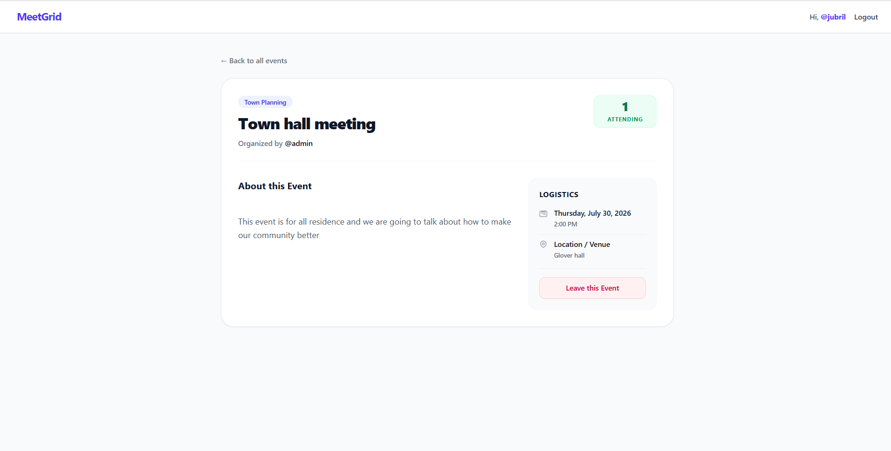
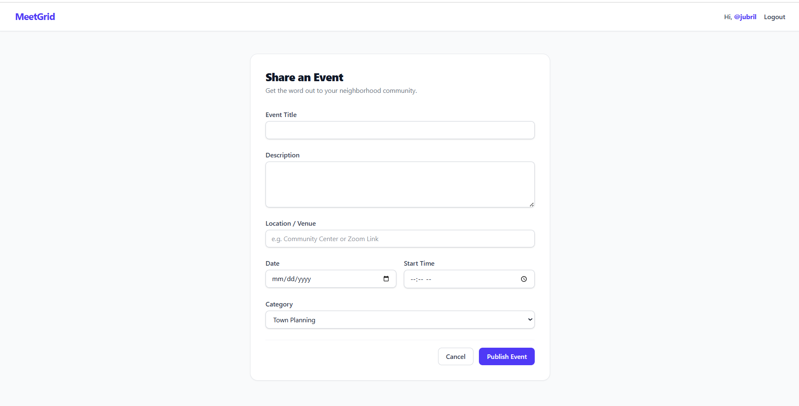
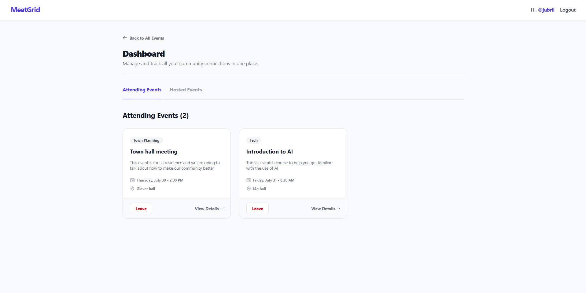

# MeetGrid

MeetGrid is a full-stack community event platform built with Django that enables users to create, discover, manage, and join local events. This project was developed from scratch  with a deliberate emphasis on backend architecture, relational database design, authentication, authorization, PostgreSQL deployment, and application logic over frontend complexity.

---
## Live Demo

 **[View Live Application](https://meetgrid.onrender.com)**

 ---

# Project Overview

MeetGrid centralizes the process of organizing and discovering community events such as study groups, technology meetups, sports activities, and educational sessions.

Rather than serving as a basic CRUD application, the project was designed to explore how multiple backend components work together within a real-world Django application, including:

- User authentication
- Permission-based authorization
- Relational database modelling
- Search and filtering
- Form handling and validation
- Template inheritance
- Many-to-many relationships
- Secure CRUD operations

This application follows Django's Model-Template-View (MTV) architecture and makes extensive use of Django's built-in authentication framework and ORM.

---

# Data Model

This application revolves around two primary entities:

- User
- Event

## Event Ownership

Each event belongs to exactly one user.

```python
created_by = models.ForeignKey(
    User,
    on_delete=models.CASCADE
)
```

This relationship enables ownership-based authorization throughout the application.

---

## RSVP Relationship

User participation is implemented using Django's built-in `ManyToManyField`.

```python
attendees = models.ManyToManyField(
    User,
    related_name="attending_events",
    blank=True
)
```

A dedicated Attendance model was intentionally avoided because the relationship itself stores no additional metadata. Using a direct many-to-many relationship simplifies both the data model and ORM queries while fully satisfying the application's requirements.

This allows users to:

- Join multiple events
- Leave events
- Retrieve attendee counts efficiently
- Query every event a user is attending

---

# Authentication

Authentication is implemented using Django's built-in authentication framework.

The application supports:

- User registration
- Login
- Logout
- Session management

Protected routes are secured using:

```python
@login_required
```

ensuring that only authenticated users can perform actions requiring authorization.

---

# Authorization

Authentication alone does not provide sufficient security.

MeetGrid performs ownership verification before allowing users to modify application resources.

Only the creator of an event may:

- Edit an event
- Delete an event

Unauthorized modification attempts return an HTTP 403 Forbidden response.

Example:

```python
if event.created_by != request.user:
    return HttpResponseForbidden(...)
```

This prevents users from manipulating resources simply by modifying URLs.

---

# Event Management

MeetGrid implements complete CRUD functionality.

Authenticated users can:

- Create events
- View events
- Update events
- Delete events

Both event creation and editing are implemented using Django ModelForms, reducing boilerplate while providing automatic validation and model binding.

---

# RSVP Implementation

The RSVP system demonstrates Django's many-to-many relationships.

Users can:

- Join events
- Leave events
- View attendee counts
- View all joined events within their profile

Relationship management is performed using Django ORM methods.

```python
event.attendees.add(request.user)
```

```python
event.attendees.remove(request.user)
```

---

# Search and Filtering

MeetGrid provides server-side event discovery through Django ORM queries.

Users can search events by:

- Title
- Location

Events can also be filtered by category.

Search and filtering are implemented entirely through QuerySets without introducing unnecessary database complexity.

---

# User Dashboard

Each authenticated user has a dedicated dashboard displaying:

## Hosted Events

Events created by the authenticated user.

## Attending Events

Events joined through the RSVP system.

This provides a centralized overview of user activity while demonstrating reverse relationship queries through Django's ORM.

---

# Forms

Event creation and editing are implemented using Django's `ModelForm`.

Using ModelForms provides:

- Automatic validation
- Reduced boilerplate
- Automatic model binding
- Reusable form logic
- Cleaner views

The same form class is reused for both creating and editing events, improving maintainability.

---

# Security

The application incorporates several backend security practices.

- CSRF protection on forms
- Authentication-protected routes
- Ownership verification
- Server-side validation
- HTTP 403 responses for unauthorized access

Sensitive operations are never trusted to client-side validation alone.

---

# Technologies Used

## Backend

- Python
- Django
- Django ORM
- SQLite

## Frontend

- HTML5
- Tailwind CSS
- Django Templates

## Authentication

- Django Authentication Framework

## Version Control

- Git
- GitHub

---

# Key Django Concepts Demonstrated

- Model Design
- ForeignKey Relationships
- Many-to-Many Relationships
- ModelForms
- Function-Based Views
- URL Routing
- Template Inheritance
- Django ORM
- Authentication
- Authorization
- CRUD Operations
- Search & Filtering
- Context Processors
- QuerySets
- Permission-Based Access Control

---

# Design Decisions

## Function-Based Views

Function-Based Views were chosen instead of Class-Based Views to develop a deeper understanding of Django's request-response cycle before introducing higher-level abstractions.

---

## Many-to-Many RSVP

The RSVP system uses Django's `ManyToManyField` instead of a separate Attendance model because the relationship itself stores no additional state beyond participation.

This keeps the data model simple while remaining fully extensible should additional RSVP metadata be required in the future.

---

## Backend-Focused Development

Frontend styling was intentionally kept lightweight using Tailwind CSS so that development effort could focus primarily on backend architecture, database relationships, and application logic.

---

# Screenshots

## Landing Page



---

## Events Page



---

## Event Details



---

## Create Event



---

## User Dashboard



---

# Installation

Clone the repository

```bash
git clone https://github.com/Dabi-Jay/MeetGrid.git
```

Navigate into the project

```bash
cd MeetGrid
```

Create a virtual environment

```bash
python -m venv .venv
```

Activate the virtual environment

### Windows

```bash
.venv\Scripts\activate
```

### macOS/Linux

```bash
source .venv/bin/activate
```

Install dependencies

```bash
pip install -r requirements.txt
```

Apply migrations

```bash
python manage.py migrate
```

Start the development server

```bash
python manage.py runserver
```

Visit:

```
http://127.0.0.1:8000/
```

---

# Future Improvements

Potential future enhancements include:

- Django REST Framework API
- Pagination
- Email notifications
- Event image uploads
- Google Maps integration
- Password reset via email
- Event bookmarking
- Event comments
- Profile pictures